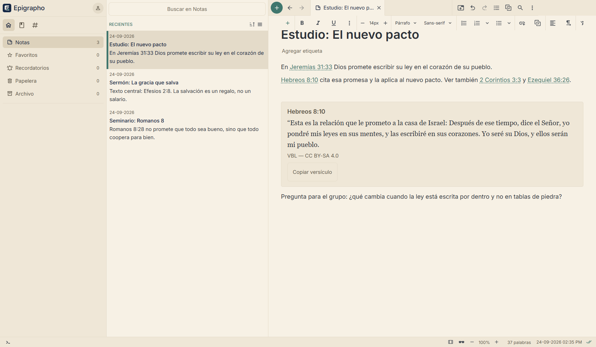
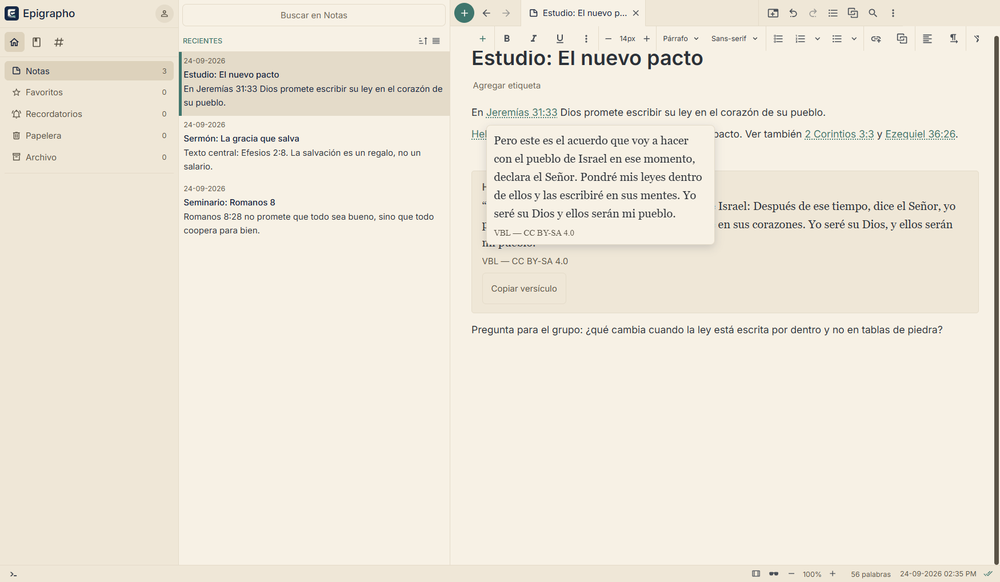
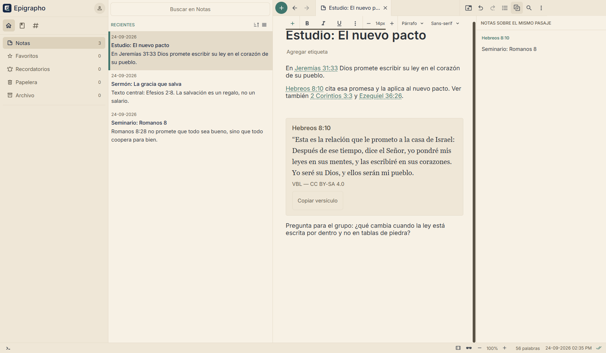
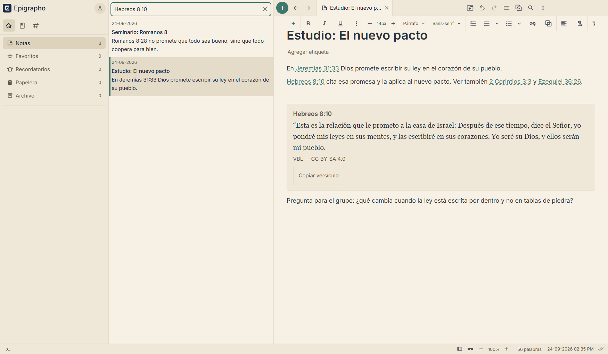
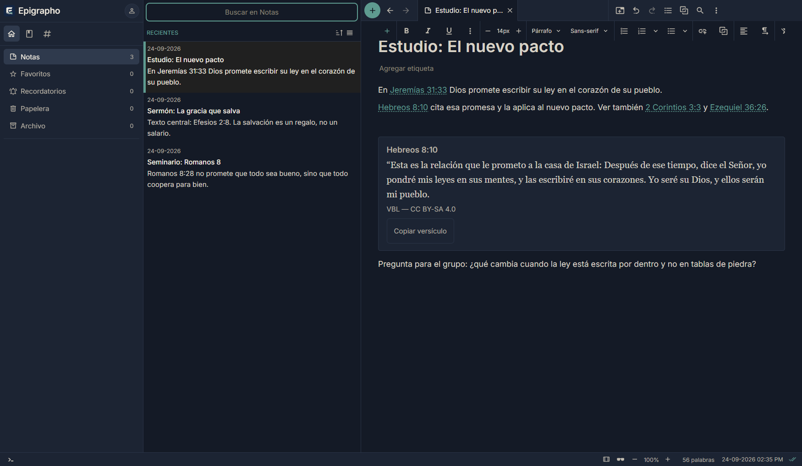

<p align="center">

</p>

<h1 align="center">Epigrapho</h1>
<h3 align="center">Una aplicación privada de notas que entiende las Escrituras.</h3>
<p align="center"><em>Escribe. Estudia. Conecta las Escrituras.</em></p>

<p align="center">
<a href="https://sourceforge.net/projects/epigrapho/files/epigrapho_win_x64.exe/download"><strong>Descargar para Windows</strong></a>
·
<a href="#linux">Instalar en Linux</a>
·
<a href="#macos">Instalar en macOS</a>
·
<a href="https://github.com/teamazteya/epigrapho/issues/new/choose">Reportar un problema</a>
</p>

<p align="center">

</p>

## Panorama

Epigrapho es una app de notas para quien estudia la Biblia y escribe mientras lo hace: estudio personal, preparación de enseñanza, notas de seminario. En ella una referencia bíblica es un objeto, no un texto suelto. Al escribir «Juan 3:16» (o «Juan 3,16», o «John 3:16») la app la reconoce, la guarda en formato USFM (`JHN.3.16`) y muestra el versículo al pasar el cursor, sin salir de la nota. Después puedes encontrar todas las notas que citan ese mismo pasaje.

Tus notas son tuyas. Viven en tu equipo, cifradas, y funcionan sin conexión. No hay cuentas, suscripciones ni funciones de pago.

### De dónde viene el nombre

_Epigrapho_ viene del verbo griego **ἐπιγράφω** (_epigraphō_, Strong G1924): escribir sobre, inscribir, grabar.

El verbo aparece en Hebreos 8:10, en la promesa del nuevo pacto:

> ἐπὶ καρδίας αὐτῶν **ἐπιγράψω** αὐτούς
>
> «Sobre sus corazones las escribiré».

_ἐπιγράψω_ es la primera persona del futuro: «escribiré», «inscribiré». De ahí salen las tres ideas que guían la app:

- **La Escritura como algo que se interioriza**, no solo se consulta.
- **Escribir como parte del estudio y de la memoria.**
- **Conectar las Escrituras con las notas personales**, para que un pasaje reúna todo lo que has escrito sobre él.

El nombre es una inspiración, no una declaración doctrinal: Epigrapho no pretende cumplir ni sustituir el sentido del pasaje.

### De dónde viene la app

Epigrapho la hace Azteya. Está construida sobre [Notesnook](https://github.com/streetwriters/notesnook), una app de notas de código abierto, cifrada de extremo a extremo y _local-first_. Esa base aporta la privacidad, el editor y el almacenamiento. Epigrapho agrega todo lo que tiene que ver con las Escrituras. Por eso es software libre bajo la misma licencia, GPLv3: «privada» se refiere a tus datos, no al código.

## Qué hace

- **Referencias vivas.** Detecta las referencias mientras escribes, en español y en inglés, y las marca sin tocar tu texto.
- **Vista previa del versículo.** Pasa el cursor sobre una referencia y lee el texto ahí mismo.
- **Bloques de Escritura.** Inserta un pasaje con su texto, su traducción y su licencia, listo para copiar.
- **Backlinks por pasaje y búsqueda por referencia.** Notas dispersas se vuelven un corpus que puedes consultar.
- **Traducciones sin conexión:** VBL (CC BY-SA 4.0), BSB, KJV y PdDpt (CC BY 4.0) vienen dentro de la app.
- **Traducciones en línea:** NTV, NBLA y NASB se piden a API.Bible. Solo se envía la referencia; el texto de tus notas nunca sale del equipo.
- **Corrector ortográfico sin conexión** en español e inglés, con un paquete de términos bíblicos y tu propio diccionario.
- **Importa tus notas** de Notesnook, Evernote, Google Keep, Simplenote, Joplin, Markdown y más.

## Capturas

|                                                                                                            |                                                                                                |
| :--------------------------------------------------------------------------------------------------------: | :--------------------------------------------------------------------------------------------: |
|  |  |
|                               Vista previa del versículo al pasar el cursor                                |                                Notas que citan el mismo pasaje                                 |
|                            |                         |
|                    Búsqueda por pasaje: «Hebreos 8:10» encuentra las notas que lo citan                    |                                          Tema oscuro                                           |

## Instalación

### Windows

1. Descarga el instalador: [epigrapho_win_x64.exe](https://sourceforge.net/projects/epigrapho/files/epigrapho_win_x64.exe/download).
2. Ábrelo. La app se instala y se abre sola.

El instalador todavía no está firmado. Si Windows muestra «Windows protegió su PC», elige **Más información** y luego **Ejecutar de todas formas**.

### Linux

Hay paquetes para x86_64. Copia los comandos de tu distribución en una terminal.

**Debian, Ubuntu, Linux Mint, Pop!\_OS**

```bash
wget -O epigrapho.deb https://sourceforge.net/projects/epigrapho/files/epigrapho_linux_amd64.deb/download
sudo apt install ./epigrapho.deb
```

**Fedora**

```bash
wget -O epigrapho.rpm https://sourceforge.net/projects/epigrapho/files/epigrapho_linux_x86_64.rpm/download
sudo dnf install ./epigrapho.rpm
```

**Arch Linux, CachyOS, EndeavourOS, Manjaro**

```bash
wget -O epigrapho.pacman https://sourceforge.net/projects/epigrapho/files/epigrapho_linux_x64.pacman/download
sudo pacman -U ./epigrapho.pacman
```

**Cualquier otra distribución (AppImage)**

```bash
wget -O Epigrapho.AppImage https://sourceforge.net/projects/epigrapho/files/epigrapho_linux_x86_64.AppImage/download
chmod +x Epigrapho.AppImage
./Epigrapho.AppImage
```

Si el AppImage no abre, instala FUSE 2. En Ubuntu 24.04 es `sudo apt install libfuse2t64`, y en versiones anteriores `sudo apt install libfuse2`.

Después de instalar, Epigrapho aparece en el menú de aplicaciones.

**Desinstalar**

```bash
sudo apt remove epigrapho-desktop      # Debian y Ubuntu
sudo dnf remove epigrapho-desktop      # Fedora
sudo pacman -R epigrapho-desktop       # Arch y CachyOS
```

### macOS

Requiere macOS 11 o posterior. Hay versiones para Apple Silicon (M1 en adelante) y para Intel.

**Con Homebrew (recomendado)**

```bash
brew install --cask teamazteya/epigrapho/epigrapho
```

Homebrew elige solo la versión de tu Mac. Para actualizar, usa `brew upgrade --cask epigrapho`; para desinstalar, `brew uninstall --cask epigrapho` (tus notas se conservan).

**Con la terminal, sin Homebrew**

```bash
arch=$([ "$(uname -m)" = "arm64" ] && echo arm64 || echo x64)
curl -L -o /tmp/epigrapho.zip "https://downloads.sourceforge.net/epigrapho/epigrapho_mac_$arch.zip"
ditto -x -k /tmp/epigrapho.zip /Applications
rm /tmp/epigrapho.zip
open /Applications/Epigrapho.app
```

**A mano**

Descarga el `.dmg` de tu Mac, ábrelo y arrastra Epigrapho a Aplicaciones:

- Apple Silicon: [epigrapho_mac_arm64.dmg](https://sourceforge.net/projects/epigrapho/files/epigrapho_mac_arm64.dmg/download)
- Intel: [epigrapho_mac_x64.dmg](https://sourceforge.net/projects/epigrapho/files/epigrapho_mac_x64.dmg/download)

La app todavía no está firmada por Apple. Si macOS no la deja abrir la primera vez, ve a Ajustes del Sistema → Privacidad y seguridad y pulsa **Abrir de todos modos**.

## Desarrollo

Requisitos: Node 22.23.2 y npm.

```bash
npm ci --ignore-scripts
npm run bootstrap -- --scope=web
npm run bootstrap -- --scope=desktop
npm run start:desktop
```

Para generar los instaladores de Windows, macOS o Linux se siguen estos pasos. Son los mismos que ejecuta `.github/workflows/epigrapho.installers.yml`:

```bash
cd apps/desktop
node scripts/build.mjs --rebuild
npm exec --no -- electron-builder install-app-deps
npx electron-builder --config=electron-builder.config.js --publish=never
```

Los paquetes de Linux se generan en Linux con esos mismos pasos, después de instalar `rpm` y `libarchive-tools`.

Las verificaciones de extremo a extremo están en `apps/desktop/scripts/a0-*.mjs` y `a1-*.mjs`. Se ejecutan con `npm run start:desktop` corriendo. Las guías para contribuir están en [CONTRIBUTING.md](./CONTRIBUTING.md).

## Soporte

- Correo: support@azteya.tech
- Reportes y sugerencias: [issues](https://github.com/teamazteya/epigrapho/issues/new/choose)

## Licencia

GPL-3.0-or-later. Epigrapho es una versión modificada de [Notesnook](https://github.com/streetwriters/notesnook) (© Streetwriters) y se distribuye bajo la misma licencia. Consulta [LICENSE](./LICENSE) y [AUTHORS](./AUTHORS).
